# TS Habitat v2

Habitat v2 extends the verifier-first vertical slice into a bounded persistent symbolic world. It remains deterministic, local, model-free, and verifier-gated.

```mermaid
flowchart LR
    A[Input] --> B[Deterministic parse]
    B --> C[MeaningGraph]
    C --> D[Semantic merge]
    D --> E[Cluster activation]
    E --> F[Signed world projection]
    F --> G[ReasoningRequest]
    G --> H[TS Reasoner verifier]
    H --> I[Transition / causal / planner]
    I --> J[Support-checked renderer]
    J --> K[TurnReceipt v2]
```



## Run

Clone `TS-Reasoner-v0` and `ts-chat-language` as siblings, then:

```bash
cd ts-chat-language
./scripts/run_vertical_slice.sh --verbose
```

Habitat inspection commands are `/world`, `/state`, `/facts`, `/conflicts`, `/cluster`, `/plan`, `/receipt`, `/reset`, `/verbose`, and `/compact`.

## Supported bounded grammar

- Signed state: `The door is open.`, `The door is not open.`, `Is the door open?`, `Is the door not open?`.
- Possession: `Alice owns the red key.`, `Alice does not own the red key.`, `Who owns the red key?`.
- Location: `The key is inside the box.`, `The box is in the kitchen.`, `Where is the key?`.
- Events: `Alice opens the door.`, `Bob closes the door.`, `Alice gives the red key to Sarah.`, `Alice moves to the hall.`, `Alice puts the key in the box.`.
- Causality: `If the door opens, the sensor activates.` and two-antecedent activation rules.
- Planning: `How can Alice open the north door?` over declared location, containment, locked-state, and key-compatibility facts.

## Decisions

The public category remains `ACCEPT`, `REPAIR`, or `REJECT`. Receipts and CLI output add `PREMISE_RECORDED`, `CONCLUSION_VERIFIED`, `PLAN_VERIFIED`, `REPAIR_NEEDS_USER`, `REJECT_UNSUPPORTED`, `REJECT_CONFLICTED`, or `REJECT_UNREACHABLE`.

Affirmative text can only be rendered from verifier-approved support IDs. Derived causal answers identify their derived status. Every plan step records its preconditions, effects, supports, and resulting state hash.

## Evaluation

```bash
.venv/bin/python scripts/build_habitat_v2_corpora.py
PYTHONPATH=../TS-Reasoner-v0:. .venv/bin/python -m ts_vertical_slice.habitat_evaluation
```

The frozen functional corpus has 120 cases, 20 per required family. The adversarial corpus has 102 cases across 17 attack categories. The untuned baseline is preserved. It exposed six malformed chained-event accepts; one general malformed-event guard removed them before the unchanged corpus rerun.

See [signed state](signed_world_state.md), [merge and activation](semantic_merge_and_cluster_activation.md), [events](event_transition_model.md), [planning](verified_planning.md), the [integration audit](habitat_v2_integration_audit.md), and [limitations](habitat_v2_limitations.md).
