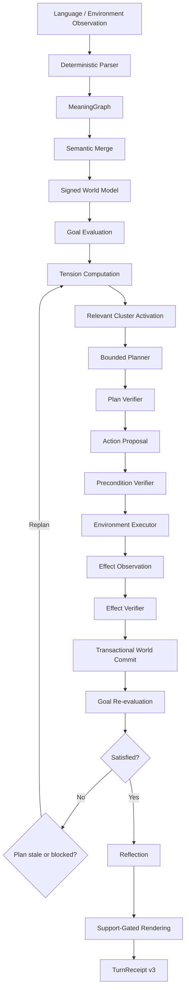

# Habitat v3: verifier-first bounded agent loop

Habitat v3 extends Habitat v2 additively. It keeps the signed semantic world and verifier authority, then adds persistent goals, deterministic tension, declared topology, a transactional symbolic environment, action-by-action execution, stale-plan detection, reflection, approved procedural lessons, bounded multi-agent scheduling and whole-run replay.



The loop phases are explicit and non-recursive: `OBSERVE`, `UPDATE_WORLD`, `EVALUATE_GOALS`, `COMPUTE_TENSION`, `SELECT_GOAL`, `ACTIVATE_CLUSTER`, `PLAN`, `VERIFY_PLAN`, `PROPOSE_ACTION`, `VERIFY_ACTION_PRECONDITIONS`, `EXECUTE_ACTION`, `VERIFY_EFFECTS`, `UPDATE_GOAL`, `REFLECT`, and terminal/replan phases. `/run` is a bounded sequence of `/step` operations.

Trust boundary: the parser, merger, goal selector, tension manager, planner, reflection engine and renderer propose or present structures. The verifier alone approves observations, goal transitions, plans, actions, effect commits, success claims and lesson approvals. A plan never mutates either environment or trusted world. Expected effects never become trusted state unless the environment reports them and the effect verifier matches them.

Compatibility: v1/v2 source paths, fixtures and `ts-turn-receipt-v2` remain unchanged. V3 uses `ts-turn-receipt-v3` and records compatible repository SHAs.

Reproduce:

```bash
PYTHONPATH=../TS-Reasoner-v0:$PYTHONPATH python3 -m unittest discover -s tests -q
scripts/run_habitat_v3.sh
scripts/record_habitat_v3_demo.sh
PYTHONPATH=../TS-Reasoner-v0:$PYTHONPATH python3 -m ts_vertical_slice.habitat_v3_evaluation
python3 -m ts_vertical_slice.chat --habitat-v3
```
