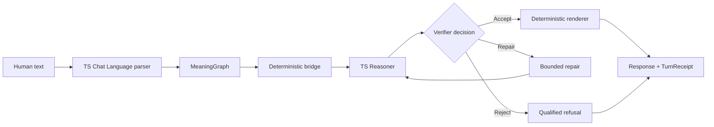

# Verifier-first chatbot vertical slice

This is the first complete deterministic path from ordinary bounded text through TSLC MeaningGraph construction and TS-Reasoner verifier authority to a natural-language response and unified receipt. It uses no external or pretrained language model.



## Install and run

Clone `TS-Reasoner-v0` and `ts-chat-language` as sibling directories, then:

```bash
cd ts-chat-language
./scripts/run_vertical_slice.sh
```

Single prompt and verbose receipt:

```bash
./scripts/run_vertical_slice.sh --prompt "Alice is older than Bob. Bob is older than Carol. Who is oldest?"
./scripts/run_vertical_slice.sh --verbose
```

The CLI supports `/help`, `/examples`, `/receipt`, `/verbose`, `/compact`, `/reset`, and `/quit`. Every turn writes deterministic JSON under `artifacts/turns/`.

## Supported families and decisions

- Relational facts, direct lookup, and `older_than` ordering chains.
- Conjunctive Boolean activation rules.
- Possibility-versus-entailment rejection.
- Ambiguous possessive clarification.
- Explicit before/after planning.

`ACCEPT` requires structured support. `REPAIR` is either a deterministic normalization that passes reverification or `REPAIR_NEEDS_USER` with a clarification question. `REJECT` records missing support, contradiction, unsupported grammar, or bridge loss. No fallback bypasses the verifier.

Conversation memory stores only verified premises and constraints with provenance. Rejected and unresolved turns cannot mutate it. `/reset` restores a canonical empty state.

## Tests, evaluation, and fixtures

```bash
PYTHONPATH=../TS-Reasoner-v0:. python3 -m unittest discover -v
PYTHONPATH=../TS-Reasoner-v0:. python3 -m ts_vertical_slice.evaluation
PYTHONPATH=../TS-Reasoner-v0:. python3 -m ts_vertical_slice.fixtures --update
```

The evaluation set contains 10 ACCEPT, 10 REPAIR, and 10 REJECT cases. Reports are written to `artifacts/vertical_slice/`. Fixture updates are explicit and never happen during normal tests.

Future learned language generation may attach only as a proposer before the bridge or as a surface candidate after verification; it must never create support, mutate accepted memory, or bypass the structured renderer gate.
